# 🛡️ Active Directory Logging & Auditing

This solo lab demonstrates how to configure and verify Windows Security Event auditing in Active Directory. The focus was on enabling audit policies, generating loggable events (like logon, user creation, group removal), and validating the results using **Event Viewer** and **PowerShell**.

---

## 🖥️ Lab Environment Setup

- ✔️ **Virtual Machines created and running**
- ✔️ One Windows Server (AD DC)
- ✔️ One domain-joined client (optional for testing)

[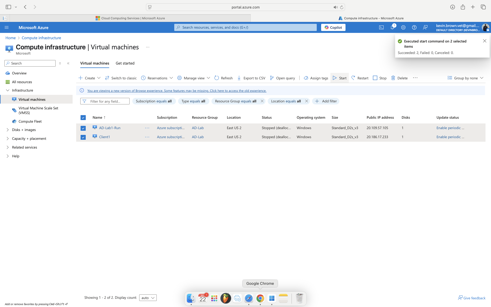](ADLA_VMsCreatedandRunning.png)

---

## 🧱 GPO Configuration + Audit Policy

### 1. New Group Policy Object Created
- Linked at domain level
- Named for auditing purposes

[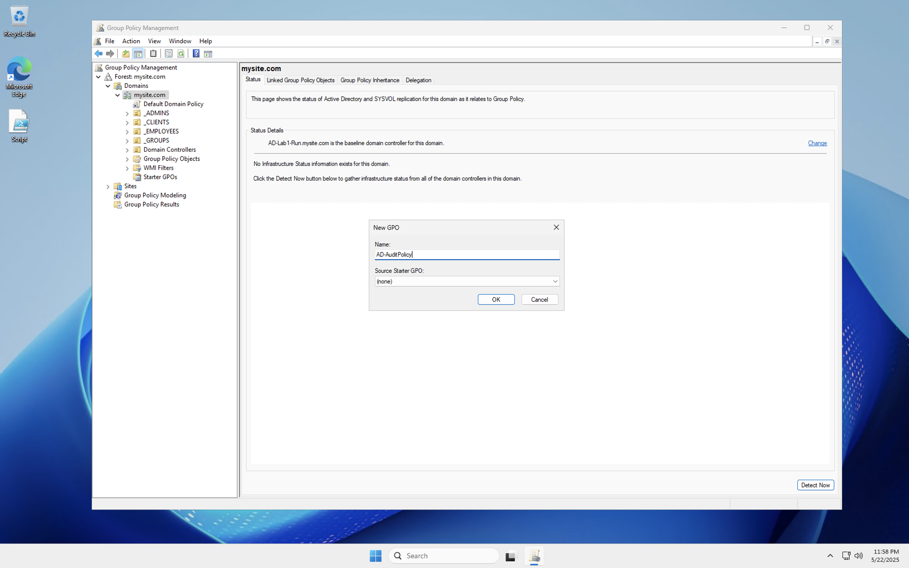](ADLA_NewGPO.png)

---

### 2. Enabled Basic Audit Policies
- Audit Logon Events: Success & Failure
- Audit Account Management
- Audit Object Access

[](ADLA_LogonEvents.png)  
[](ADLA_AuditAcctMgmt.png)  
[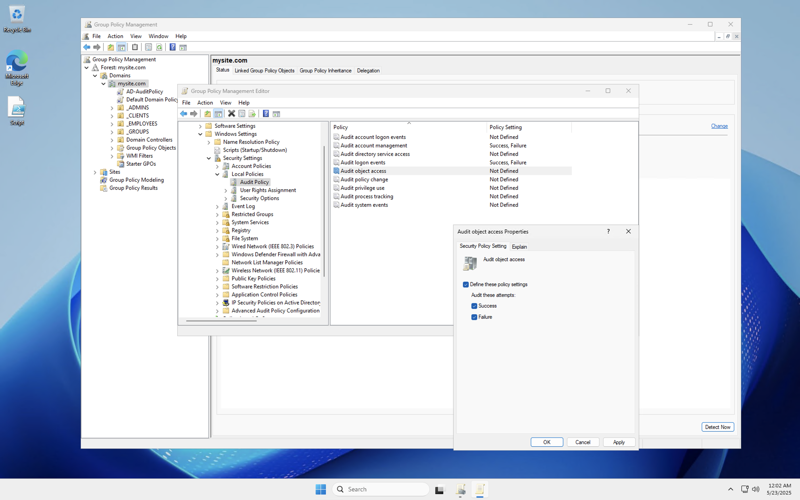](ADLA_AuditObjectAccess.png)

---

## 🔧 Simulating Domain Activity & Viewing Security Logs

After setting up the audit policies, I ran simulations to generate log activity. This included creating users, removing a group, and refreshing GPOs to enforce policy. I verified everything through **Event Viewer filters**.

---

## 👥 Active Directory User Management & Group Modification

This portion of the lab focuses on managing user accounts within a Windows Server Active Directory environment. Actions include creating new domain users and modifying group membership, both of which are essential for generating security audit events and understanding how account changes are tracked in enterprise systems.

---

### 🧑‍💼 1. Created New Domain Users

Using **Active Directory Users and Computers (ADUC)**, I created one new user accounts under the domain:

- **Purpose:** Trigger Event ID `4720` (user account creation)

These actions simulate typical IT onboarding activity.

  
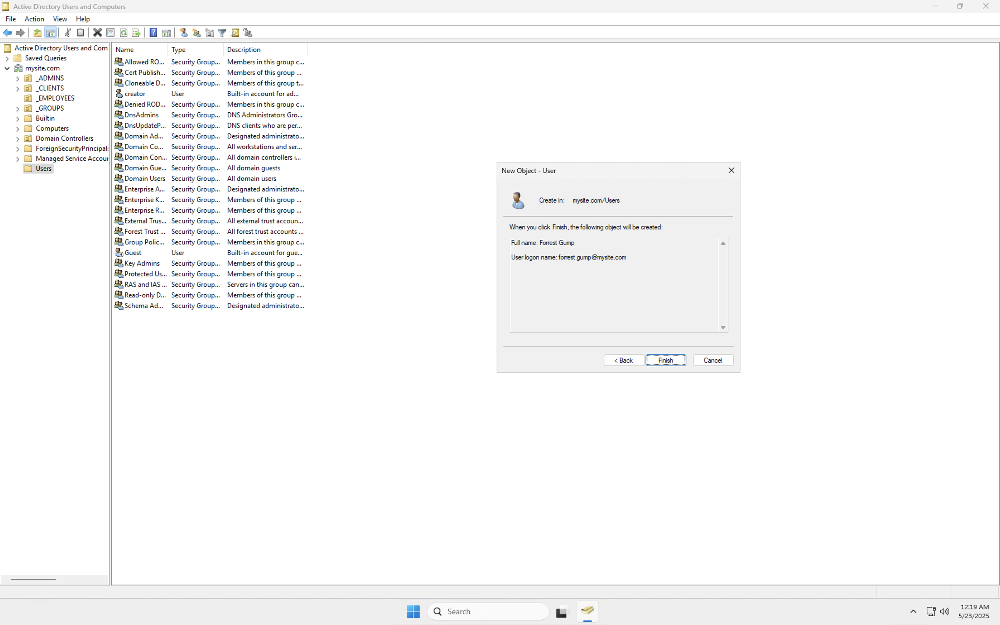

---

### 👥 2. Removed Group

Removed the group labeled "LAWYERS"

- **Purpose:** Trigger group-related security log activity
- **Event Type Expected:** `4627` (member removed from security-enabled global group)

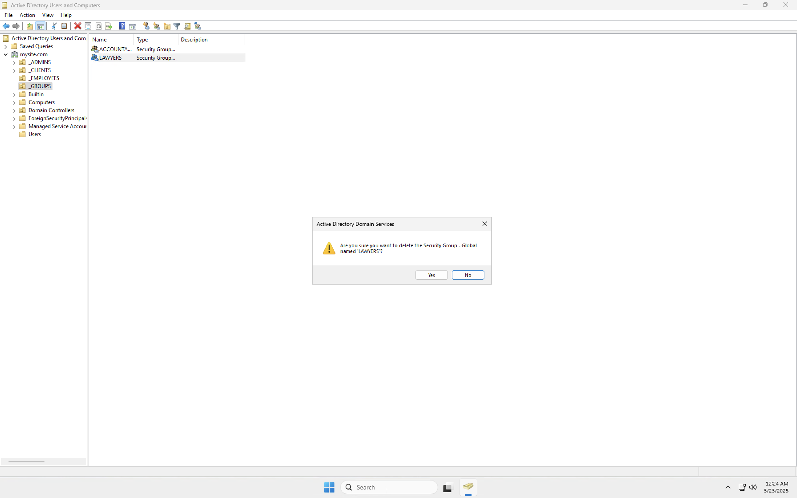

---


This log contains all domain security events — including account creation, successful logons, failed attempts, lockouts, and group modifications.

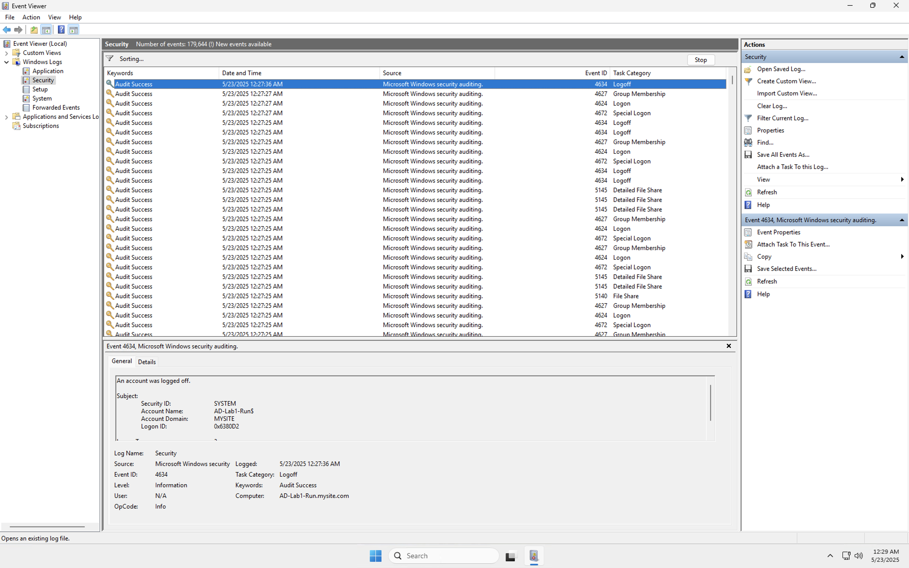

---

### 🎯 2. Applied Log Filter by Event ID

To isolate only relevant security events, I used **"Filter Current Log..."** and entered the following Event IDs:

| Event ID | Description                  |
|----------|------------------------------|
| 4624     | Successful logon             |
| 4720     | New user account created     |
| 4740     | Account lockout              |

This allowed me to focus specifically on the actions I had simulated earlier in the lab.

---

### 🟢 Event ID 4624 — Successful Logon

This log confirms that a domain user account successfully authenticated.  
Details observed:
- **Logon Type**: Interactive
- **Account Name**: `test.user`
- **Caller Process**: `winlogon.exe`  
Useful for validating login activity and origin.

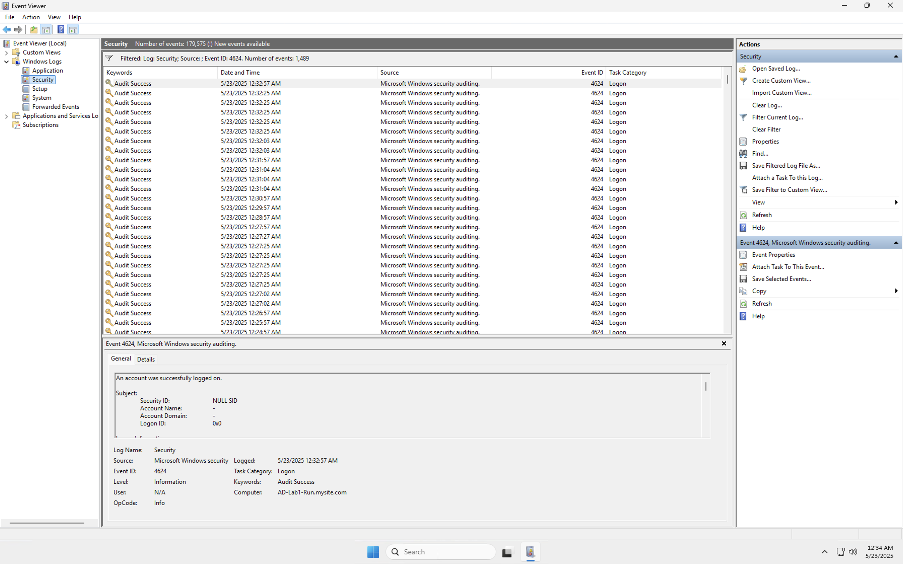

---

### 🟢 Event ID 4720 — User Account Created

This log confirms that a new Active Directory user was successfully created using ADUC.  
Details observed:
- **Created Account**: `test.user2`
- **Initiated By**: `Administrator`
- **Computer Name**: Domain Controller (e.g., `DC01`)

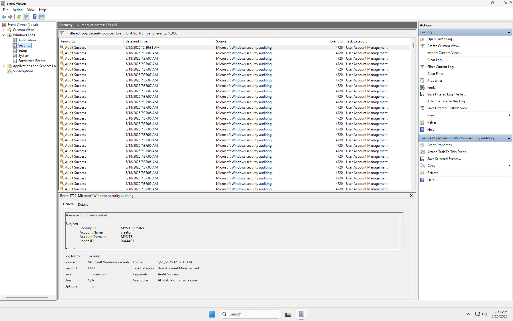

---

### 🟢 Event ID 4740 — Account Lockout

This entry indicates that `test.user2` was locked out after multiple failed login attempts, demonstrating that account protection and lockout auditing are functioning.  
Details include:
- **Locked Out User**: `test.user2`
- **Caller Computer Name**: Source of the lockout request
- **Process Name**: Auth process triggering the lock

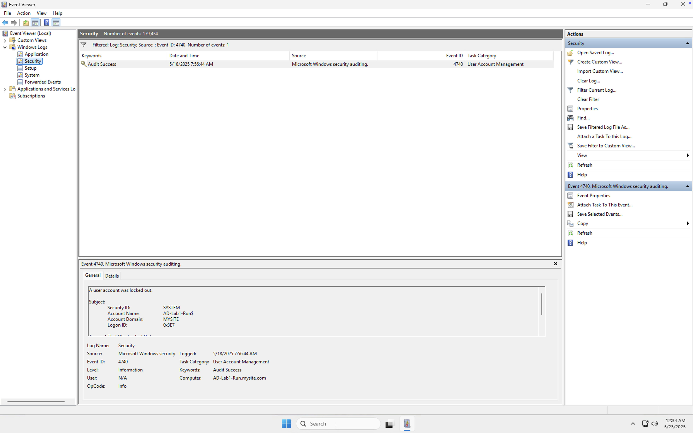

---

### 🧠 Why This Matters

By filtering and reviewing these event logs:
- ✅ I confirmed that audit policy settings were correctly applied
- ✅ Log events matched specific user actions I performed
- ✅ I learned how to track domain-level activity through logs
- ✅ I established a clear workflow for incident reconstruction and security monitoring

---

This step reinforces the importance of proper **audit configuration**, **event ID awareness**, and real-time monitoring — foundational skills for IT administration and cybersecurity.


This framework breaks auditing into **subcategories**, allowing for finer control over what Windows logs and how.

---

### ✅ 2. Enabled Granular Subcategories

I configured the following key subcategories to monitor:

#### 🔐 Logon/Logoff
- **Audit Logon** — Success, Failure  
- Tracks both interactive and network logon attempts.

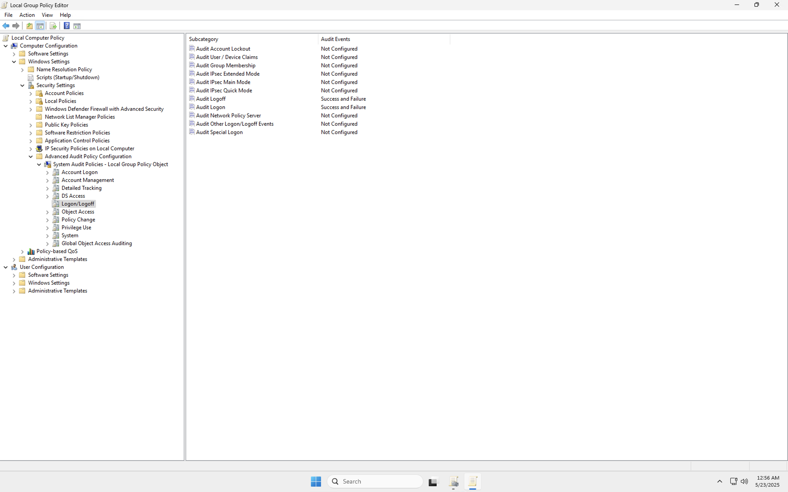

---

#### 👤 User Account Management
- **Audit User Account Management** — Success, Failure  
- Captures account creation, deletion, enabling/disabling, and password changes.

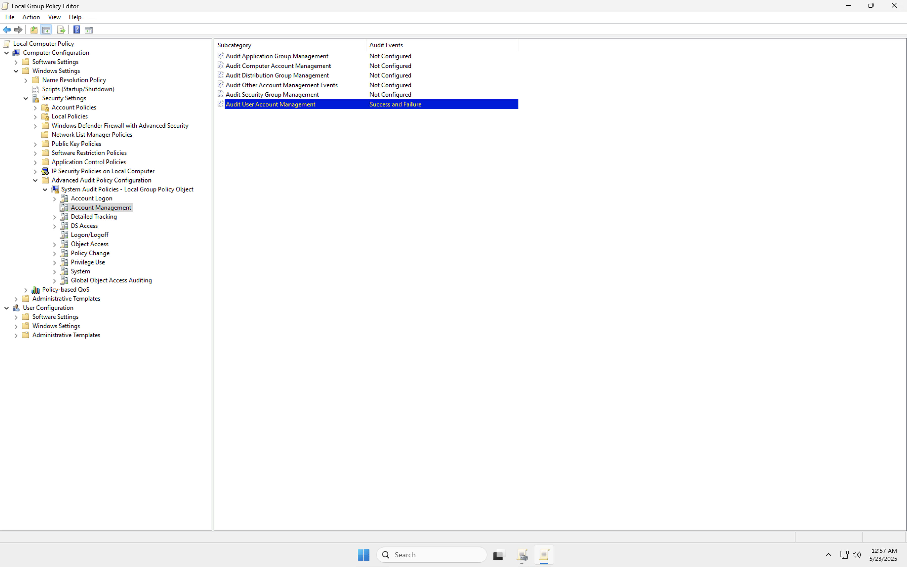

---

### 🔄 3. Refreshed Group Policy to Apply Changes

To ensure these settings took effect, I ran another:

```powershell
gpupdate /force

## 🧾 Event Log Parsing Using PowerShell

As a final step in this solo Active Directory auditing project, I used **PowerShell** to filter and export specific security event logs. This demonstrates how to work with logs at scale — a vital skill for incident response, reporting, and automation.

---

### 🧪 Goal

Extract logs related to **user account creation** (`Event ID 4720`) and export them into a readable `.csv` format for reporting and documentation purposes.

---

### 💻 PowerShell Command Used

```powershell
Get-WinEvent -LogName Security -FilterHashtable @{Id=4720} |
  Select-Object TimeCreated, Id, Message |
  Export-Csv "C:\Logs\AD_UserCreation.csv" -NoTypeInformation
